# Instructions d'installation

- Cloner le référentiel :
```shell
git clone git@github.com:YamineTamourt/docker-sae203.git
```

- Aller au répertoire :
```shell
cd docker-sae203.git
```

- Construction du conteneur :
```
docker build -t jellyfin-yt .
```
- Lancer le service :
```
docker run -it -p 8000:8096 jellyfin-yt
```

- Copier le lien de la video ou playlist youtube à télécharger et qui sera dans la médaithèque, ou ne rien mettre pour obtenir la médiathèque d'exemple :

```
Entrer le lien de la playlist/video (vide pour generer la playlist d'exemple)

https://www.youtube.com/watch?v=ZA3Tym3SQTs

telechargement de la playlist/video ...
```
- Après le téléchargement, vérifier que l'application est en cours d'exécution. Pour ce faire, ouvrir un navigateur et taper ```localhost:8000/```

- Si on vous demande de choisir un serveur, supprimmer les tous (en appuyant sur les 3 points et en cliquant sur supprimer) et retaper ```localhost:8000/```

- Si vous vouyez cette page, vider le cache du navigateur. Sinon, passer à l'étape suivante :

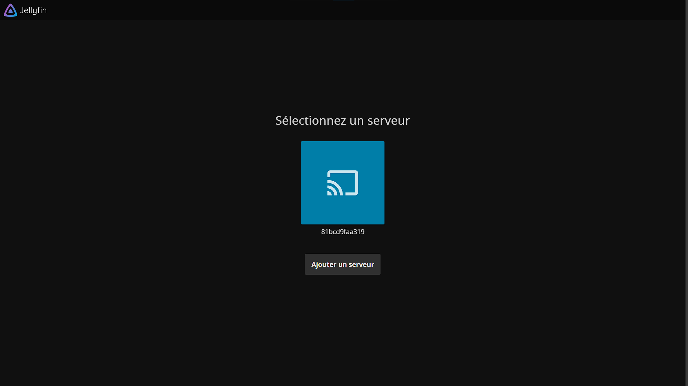

- Choisir votre langue d'affichage, puis cliquer sur Prochain (ou Next en anglais) :

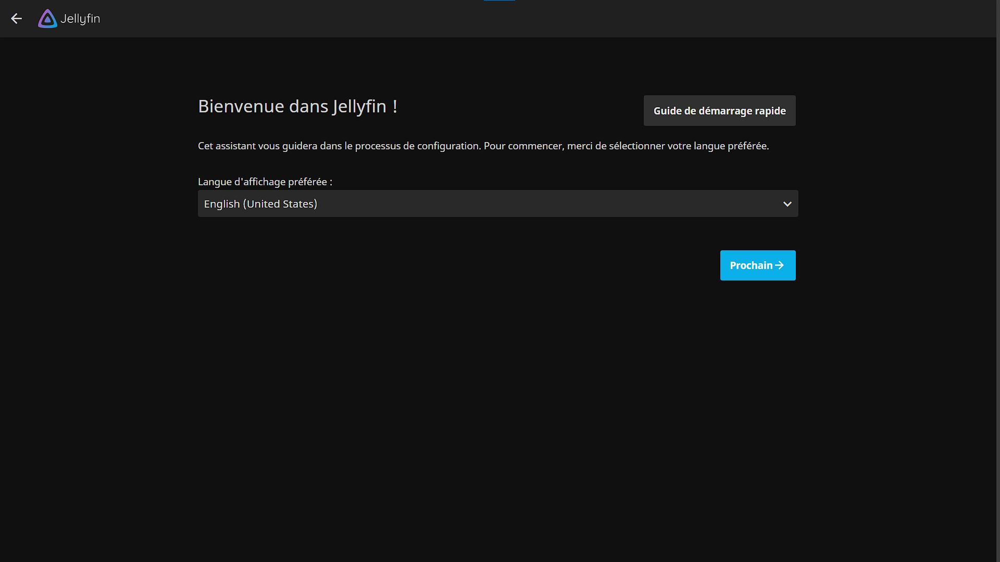

- Creer un nom d'utilisateur ainsi qu'un mot de passe, puis cliquer sur Prochain :

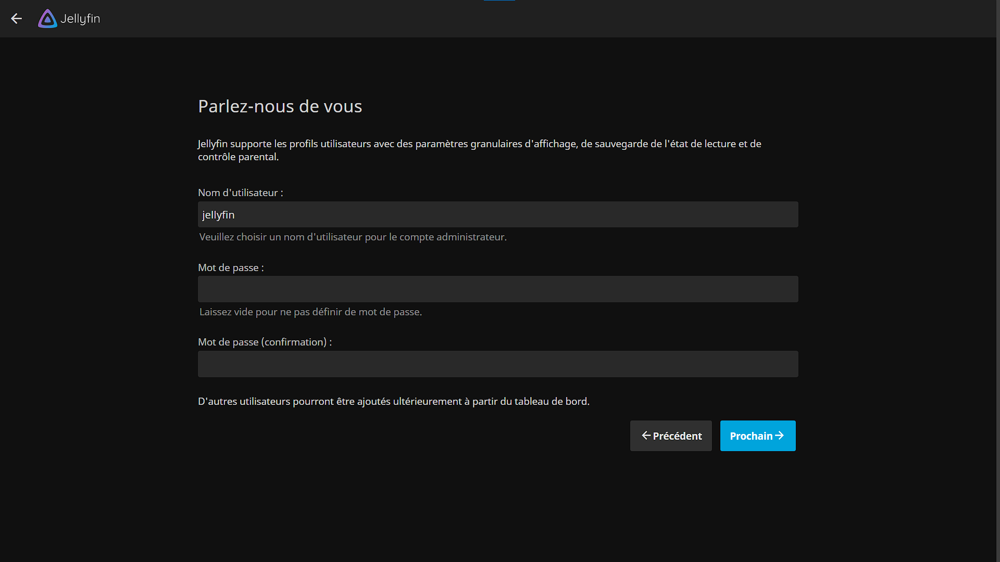

- Cliquer sur "+" pour ajouter une médiatheque :

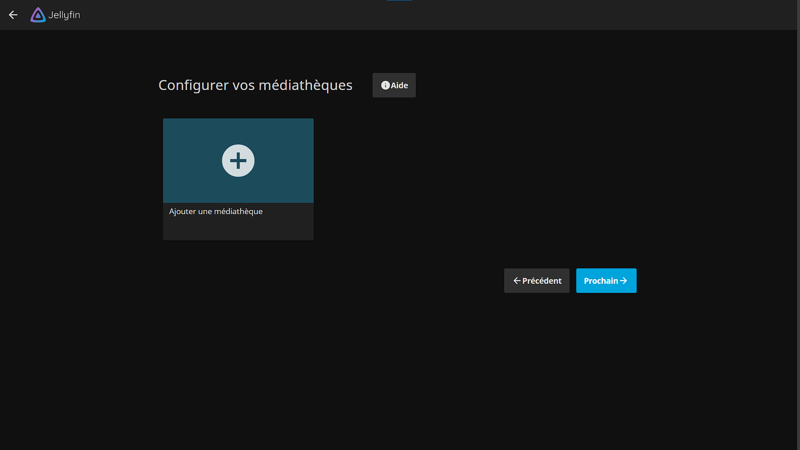

- Ajouter un nom a votre mediatheque et cliquer sur "+" :

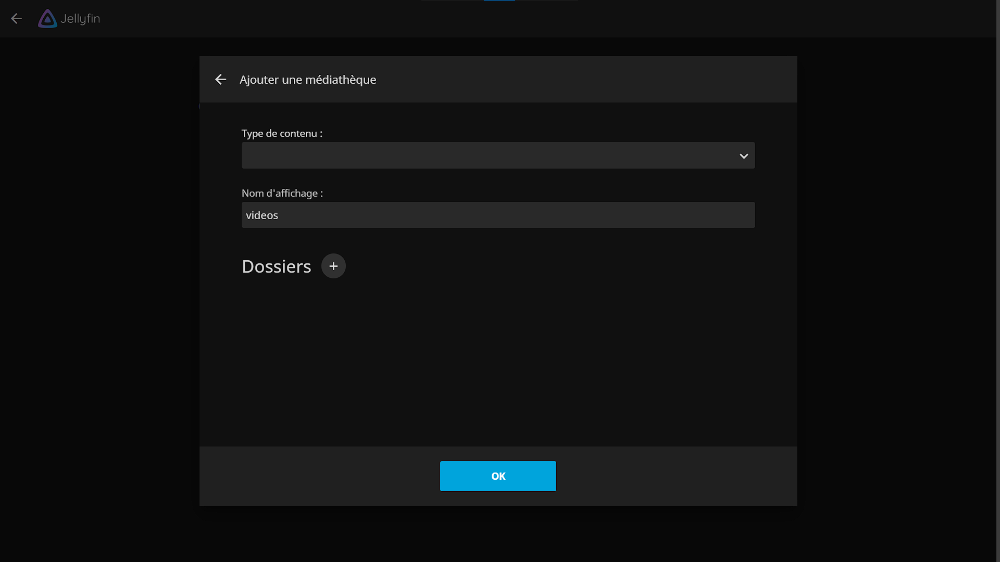

- Selectionner le répertoire "/media", puis cliquer sur OK et encore sur OK :

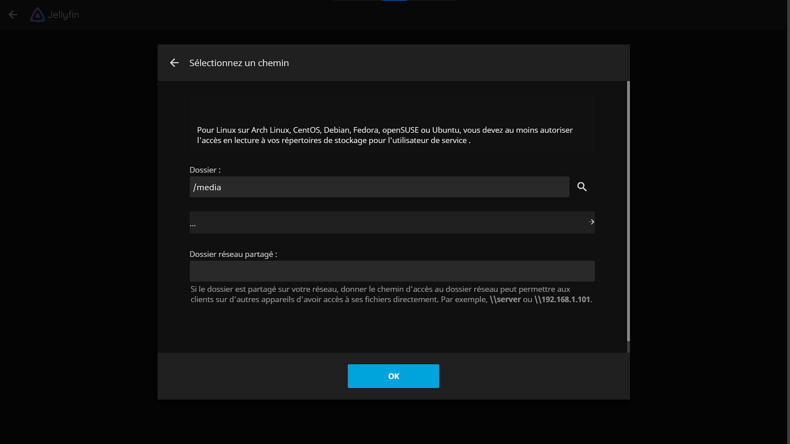

- Cliquer sur Prochain :

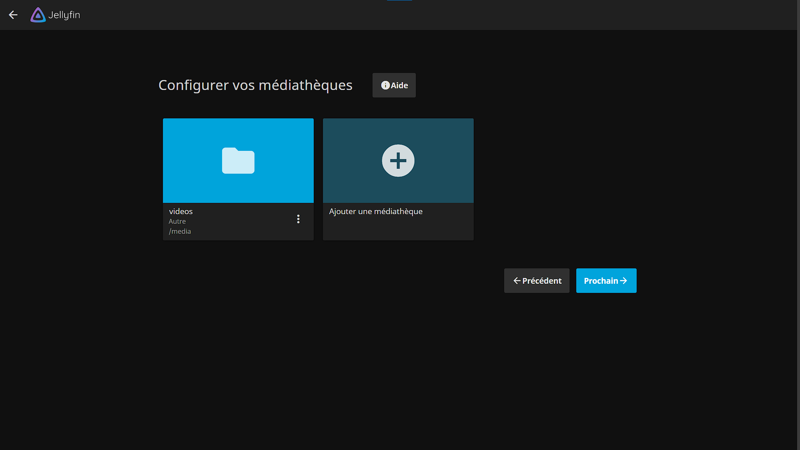

- Choisir une langue pour les métadonnées, puis cliquer sur Prochain : 

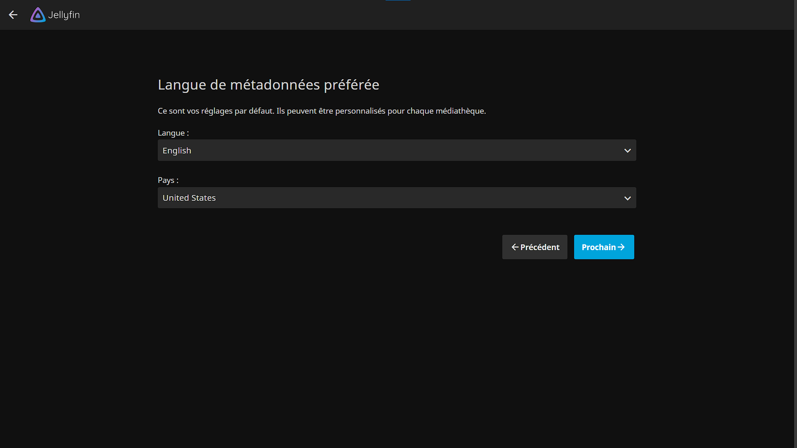

- Cliquer sur Prochain :

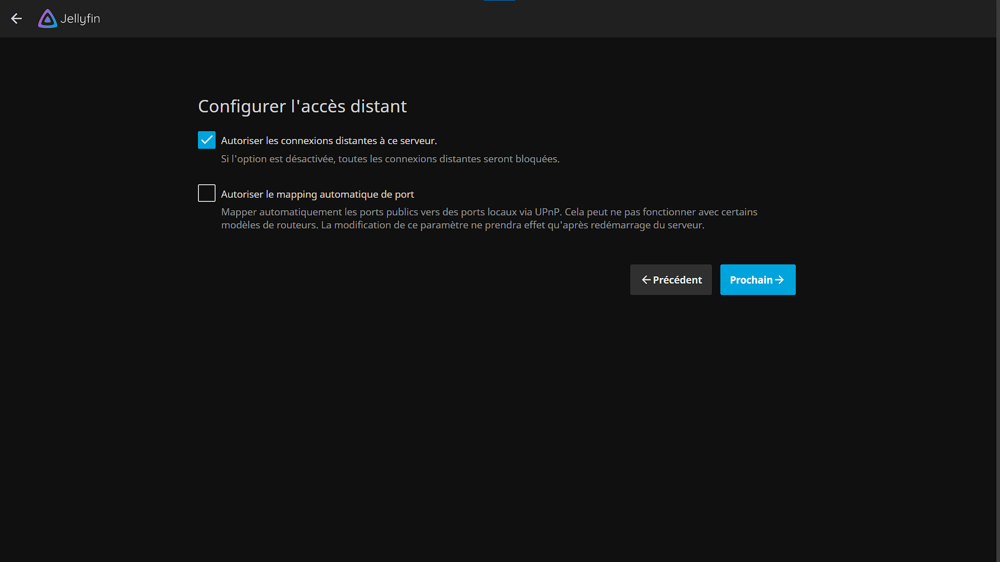

- Cliquer sur Terminer :

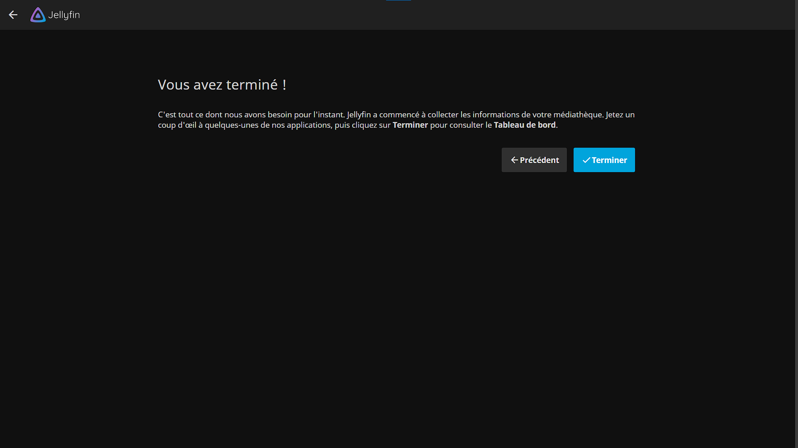

- Se connecter avec le compte utilisateur créé précédemment :

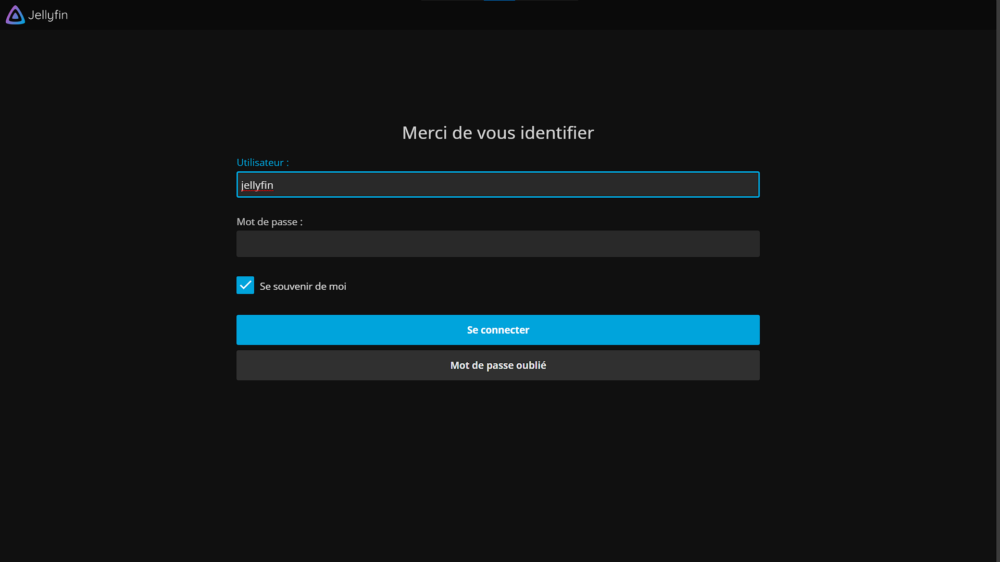

- Voici donc les vidéos téléchargés :

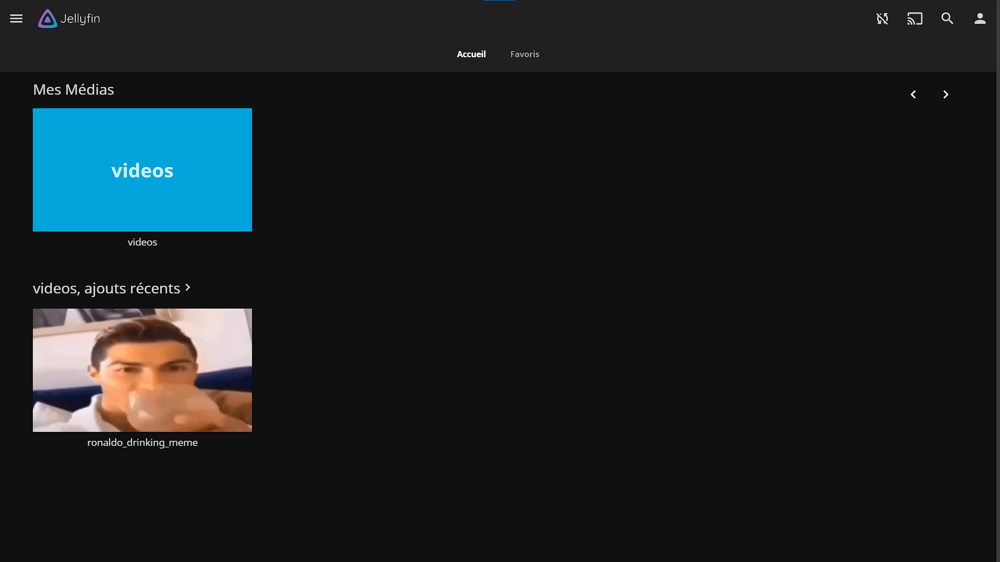
